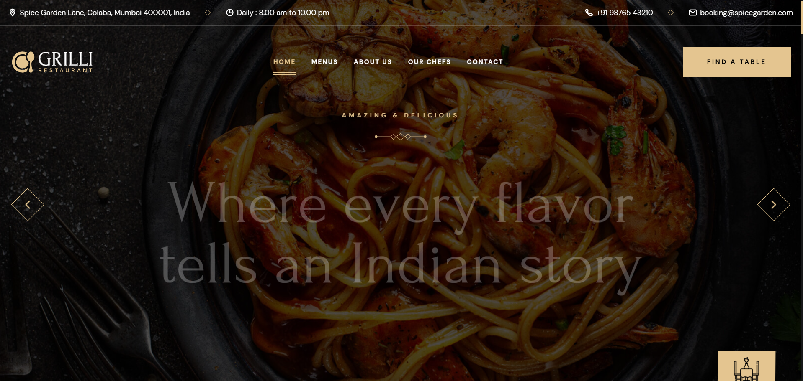
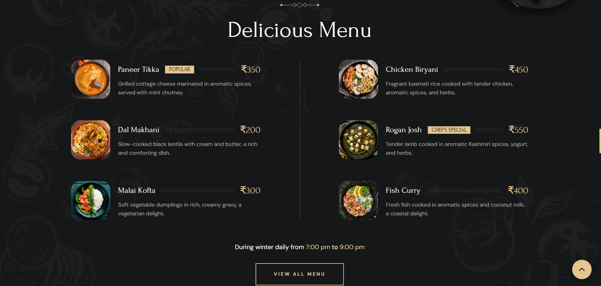
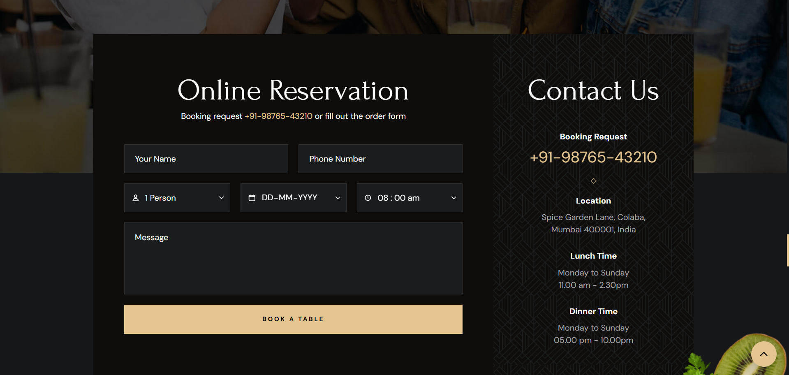

# 🍴 Restaurant Web App

A modern and responsive **Restaurant Web Application** built to showcase menus, take reservations, and enhance customer engagement with an elegant user interface.  

---

## ✨ Features
- 📱 Fully responsive design for desktop & mobile  
- 🛒 Interactive menu with categories  
- 🗓️ Table reservation system  
- 🖼️ Image gallery and highlights  
- 📍 Contact form & location integration  
- ⚡ Fast, lightweight, and easy to customize  

---

## 🚀 Tech Stack
- **Frontend:** HTML5, CSS3, JavaScript  
- **Styling:** CSS Animations  
- **Assets:** Images, SVGs, and icons provided in `/assets`  

---

## 📂 Folder Structure
```
Restaurant-Web-App-main/
│── favicon.svg
│── index.html
│── index.txt
│── style-guide.md
│── assets/
│   │── css/
│   │   ├── style.css
│   │── images/
│   │── js/
│   │   ├── script.js
│── readme-images/
│   ├── (place screenshots here)
```

---

## 🛠️ Installation & Setup

1. Clone this repository  
   ```bash
   git clone https://github.com/your-username/Restaurant-Web-App.git
   ```
2. Navigate to project folder  
   ```bash
   cd Restaurant-Web-App
   ```
3. Open `index.html` in your browser, or run a local server:  
   ```bash
   # Example using VS Code Live Server
   code .
   ```

---

## 🎥 Demo Video


---

## 🖼️ Screenshots

| Home Page | Menu Page | Reservation |
|-----------|-----------|-------------|
|  |  |  |

---

## 🤝 Contributing
Contributions, issues, and feature requests are welcome!  
Feel free to fork this repo and submit a Pull Request.  

1. Fork the project  
2. Create your feature branch (`git checkout -b feature/AmazingFeature`)  
3. Commit your changes (`git commit -m 'Add some AmazingFeature'`)  
4. Push to the branch (`git push origin feature/AmazingFeature`)  
5. Open a Pull Request  

---

## 💡 Author
Developed by **[Aharnish Dubey](https://github.com/aharnish5)**  
